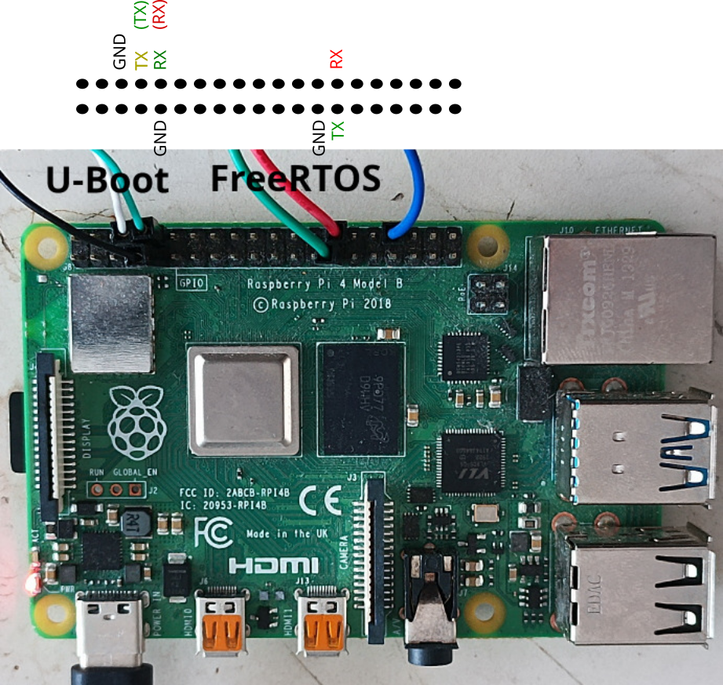
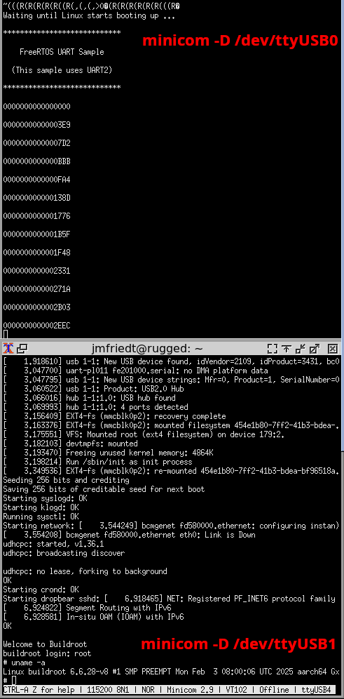
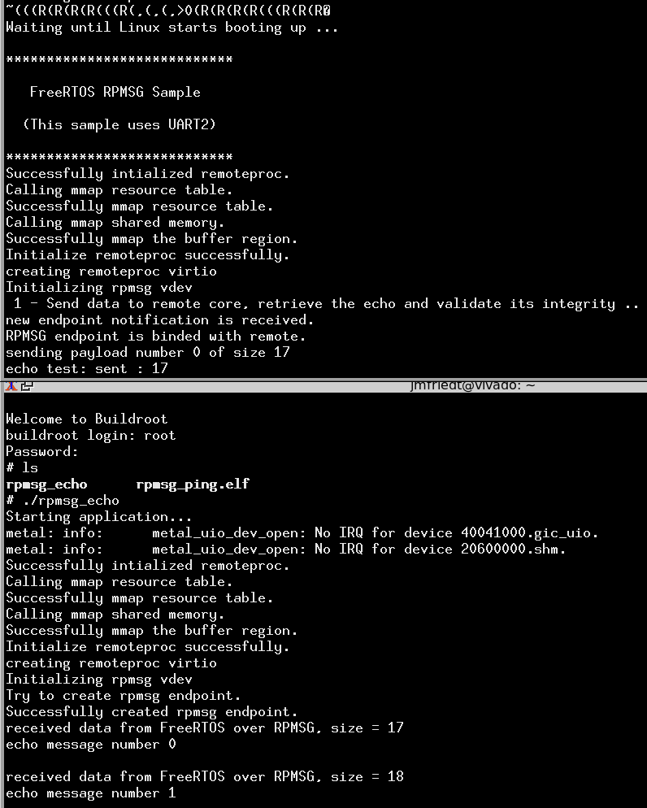

# Asymmetric MultiProcessing (AMP) on Raspberry Pi 4

## Compile Buildroot for Raspberry Pi 4:

```
wget https://buildroot.org/downloads/buildroot-2024.11.1.tar.gz
tar zxvf buildroot-2024.11.1.tar.gz
mv buildroot-2024.11.1 buildroot-2024.11.1_rpi4
cd buildroot-2024.11.1_rpi4
make raspberrypi4_64_defconfig
make
```
will create the toolchain and the basic tools needed to run GNU/Linux
on the Raspberry Pi4. Since we need U-Boot to launch FreeRTOS on one core,
still in the Buildroot directory:
```
make menuconfig
```
and go to Bootloaders -> U-Boot -> Board defconfig and fill with ``rpi_4``. Also activate the options ``U-Boot needs gnutls`` and 
``U-Boot needs OpenSSL`` to avoid the error related to missing ``openssl/evp.h``. Then
```
make
```
to compile U-Boot. Edit ``output/build/uboot-*/.config`` and uncomment ``CONFIG_CMD_CACHE=y``
to set it to active. Recompile with ``make uboot-rebuild && make`` to regenerate 
``output/build/uboot-*/u-boot.bin`` (do **not** ``make uboot-reconfigure`` which will remove
the change in the ``.config`` we just inserted).

The Buildroot configuration we used is provided in <a href="buildroot-2024.11.1_rpi4_defconfig">
buildroot-2024.11.1_rpi4_defconfig</a> or <a href="buildroot-2025.02_rpi4_defconfig">buildroot-2025.02_rpi4_defconfig</a>
and assumes, to include Open-AMP and libmetal support, that
the [BR2\_EXTERNAL](https://github.com/oscimp/oscimp_br2_external) is installed with
```
export BR2_EXTERNAL=/my/directory/oscimp_br2_external
```
to add these packages.

Configure the SD-card with ``sudo dd if=output/images/sdcard.img of=/dev/sdd bs=8M status=progress``
where ``/dev/sdd`` is replaced with the block device created when inserting the SD-card (identified
with ``sudo dmesg | tail``).

## Compile the baremetal toolchain and FreeRTOS for Raspberry Pi 4:

Following https://github.com/TImada/raspi4_freertos, compile FreeRTOS for the Raspberry Pi 4. 

First we need a cross-compilation toolchain for baremetal 64-bit ARM, which can be generated using 
Crosstool-NG (requires the packages ``libtool-bin gawk help2man texinfo`` for generating the documentation with ``makeinfo``):
```
git clone https://github.com/crosstool-ng/crosstool-ng
cd crosstool-ng/
./bootstrap
./configure
make -j12
sudo make install
./ct-ng menuconfig
```
and select under ``Target Options``: ``Target Architecture (arm)`` and ``Bitness (64-bit)``, then
```
./ct-ng build
export PATH=$HOME/x-tools/aarch64-unknown-elf/bin/:$PATH
```
This operation completes in 25 minutes on a 3.6 GHz Intel Xeon E5-1620.

## Compile the FreeRTOS example for the RPi4

Clone and compile the FreeRTOS example using the baremeta toolchain:
```
git clone https://github.com/TImada/raspi4_freertos
cd raspi4_freertos/FreeRTOS/Demo/CORTEX_A72_64-bit_Raspberrypi4/uart
make CROSS=aarch64-unknown-elf-
```
## Update the SD-card configuration to launch U-Boot

Mount the first partition of the SD-card we flashed earlier (``sudo mount /dev/sdd1 /mnt``) and
copy ``output/build/uboot-*/u-boot.bin`` from the Buildroot directory to this SD-card partition.
In this partition, also edit the content of ``config.txt`` to append with ``enable_uart=1`` and replace
``kernel=Image`` with ``kernel=u-boot.bin`` to tell the Raspberry Pi4 to launch U-Boot instead
of the Linux kernel. Finally, copy ``raspi4_freertos/FreeRTOS/Demo/CORTEX_A72_64-bit_Raspberrypi4/uart/uart.elf``
to this partition as the FreeRTOS application to be executed. Unmount the SD-card (``sudo umount /mnt``).

Launch the Raspberry Pi 4 fitted with this new SD-card: if all goes well the serial port (pins 
8 and 10) should display the U-Boot prompt:
```
U-Boot 2025.04-rc1-00063-g2b1c8d3b2da4-dirty (Feb 04 2025 - 06:45:40 +0000)

DRAM:  924 MiB (effective 3.8 GiB)
RPI 4 Model B (0xc03111)
Core:  213 devices, 17 uclasses, devicetree: board
MMC:   mmcnr@7e300000: 1, mmc@7e340000: 0
Loading Environment from FAT... Unable to read "uboot.env" from mmc0:1... 
In:    serial,usbkbd
Out:   serial,vidconsole
Err:   serial,vidconsole
Net:   eth0: ethernet@7d580000

PCIe BRCM: link up, 5.0 Gbps x1 (SSC)
starting USB...
Bus xhci_pci: Register 5000420 NbrPorts 5
Starting the controller
USB XHCI 1.00
scanning bus xhci_pci for devices... 2 USB Device(s) found
       scanning usb for storage devices... 0 Storage Device(s) found
Hit any key to stop autoboot:  0 
U-Boot> 
```
Run the following commands to launch the FreeRTOS demonstration:
```
setenv autostart yes
dcache off
fatload mmc 0:1 0x30000000 /uart.elf
dcache flush
bootelf 0x30000000
dcache on
```
resulting, on the second serial port (pins 27 and 28) in the message

```
****************************                                                    
    FreeRTOS UART Sample                                                        
  (This sample uses UART2)                                                      
****************************                                                    
0000000000000000                                                                
00000000000003E9                                                                
00000000000007D2                                                                
0000000000000BBB                                                                
```

## Running GNU/Linux next to FreeRTOS

Load and execute the Linux kernel while FreeRTOS keeps on running: notice the ``maxcpus=3`` argument to the kernel to keep one CPU dedicated to FreeRTOS. In U-Boot, [run](https://stackoverflow.com/questions/59580877/raspberry-pi-4-u-boot-on-booting-hanging-in-starting-kernel):
```
fatload mmc 0:1 ${kernel_addr_r} Image
fatload mmc 0:1 ${fdt_addr_r} bcm2711-rpi-4-b.dtb
setenv bootargs earlyprintk root=/dev/mmcblk0p2 rw rootwait maxcpus=3 console=ttyAMA0,115200
booti ${kernel_addr_r} - ${fdt_addr}
```
to start the Linux kernel and load GNU tools from the root filesystem. This sequence of commands
should display the Linux boot sequence with hardware peripheral initialization and end up with a Buildroot prompt whose root account password is ``root``.





Notice that an error message leading to the Raspberry Pi4 rebooting such as
```
"Synchronous Abort" handler, esr 0x96000021, far 0x2000a44
elr: 000000000008aab8 lr : 000000000008aaa8 (reloc)
elr: 0000000039b45ab8 lr : 0000000039b45aa8
x0 : 0000000002000a44 x1 : 0000000000000008
x2 : 000000000000000a x3 : 0000000000000064
x4 : 000000000000000a x5 : 000000000200ddff
x6 : 0000000000000a04 x7 : 0000000002000000
x8 : 00000000000009f0 x9 : 000000003972831c
x10: 0000000000000003 x11: 0000000000000998
x12: 00000000397283a8 x13: 0000000002000000
x14: 0000000000000000 x15: 0000000039728428
x16: 0000000039b70588 x17: 0000000000000000
x18: 0000000039736dd0 x19: 0000000000000998
x20: 0000000000000000 x21: 0000000002000000
x22: 0000000039bb9674 x23: 0000000039728630
x24: 0000000000000000 x25: 0000000000000000
x26: 0000000000000000 x27: 000000003974e300
x28: 000000003974e2d0 x29: 00000000397283e0

Code: b40000e0 b9403fe1 7100203f 54000081 (f9400000) 
Resetting CPU ...
```
is due to forgetting ``dcache on`` after booting FreeRTOS.

## Communication between FreeRTOS and GNU/Linux through RPMSG

As opposed to https://github.com/TImada/raspi4_freertos stating to run ``dtc`` on the target, never
ever install development tools on the target but only cross-compile on the host. We first need to add 
the RPMSG communication capability to the Linux kernel:

```
export PATH=$HOME/buildroot-2024.11.1_rpi4/output/host/usr/bin:$PATH
```
to use Buildroot's ``dtc`` command and in ``raspi4_freertos/dts`` (make sure ``which dtc`` leads
to the Buildroot ``dtc``):
```
dtc -O dtb -I dts ./raspi4-rpmsg.dtso -o ./raspi4-rpmsg.dtbo
```
and ``sudo cp raspi4-rpmsg.dtbo /mnt/overlays`` assuming the SD-card first partition is accessible 
in ``/mnt``. 

Edit in this same partition ``config.txt`` and add at the end (after ``enable_uart=1``): 
```
dtoverlay=raspi4-rpmsg
```

### FreeRTOS application

We continue with a new FreeRTOS application found at https://github.com/TImada/raspi4_freertos_rpmsg but using Buildroot and the cross-compilation toolchain generated by Crosstool-NG. 

```
git clone --recursive https://github.com/TImada/raspi4_freertos_rpmsg
```

and edit ``libmetal/cmake/platforms/raspi4-freertos.cmake`` and ``open-amp/cmake/platforms/raspi4_a72_generic.cmake`` 
to replace ``aarch64-none-elf-`` of ``CROSS_PREFIX`` with ``aarch64-unknown-elf-``. Then follow the sequence 
proposed at https://github.com/TImada/raspi4_freertos_rpmsg/blob/master/docs/freertos_build.md from step 4 and onward, making
sure the shell variable ``RASPI4_BASE`` has been set to the directory holding ``raspi4_freertos_rpmsg`` and ``raspi4_freertos``.

Add ``#include <stdint.h>`` at the beginning of ``samples/freertos/rpmsg_ping/src/uart.h``   
and an explicit cast from pointer to integer as ``irq_vect = (int)prproc->armlocal_dev->irq_info;`` in
``open-amp/apps/machine/raspi4/raspi4_a72_rproc.c`` to avoid errors with GCC-14 used to generate the toolchain
with Crosstool-NG.

### GNU/Linux application

OpenAMP and LibMetal were added to Buildroot at the https://github.com/oscimp/oscimp_br2_external ``BR2_EXTERNAL``
repository. Select these items in the Extra packages after defining ``export BR2_EXTERNAL=my/path/oscimp_br2_external``.

Since the words slave and master are [no longer](https://github.com/OpenAMP/open-amp/commit/afed3bd11737b6a1b958d22ff0da2343a6895592) allowed in American English, we must update ``samples/linux/rpmsg_echo/src/main.c``
by replacing ``VIRTIO_DEV_MASTER`` with ``VIRTIO_DEV_DRIVER`` as well as in ``open-amp/apps/machine/raspi4/platform_info.c``.
Finally we must replace ``-L/usr/local/lib`` in ``samples/linux/rpmsg_echo/build/Makefile`` with the Buildroot 
``output/host/aarch64-buildroot-linux-gnu/sysroot/usr/lib`` and similarly replace ``INCLUDEPATH1 ?= /usr/local/include`` 
with the Buildroot ``output/host/aarch64-buildroot-linux-gnu/sysroot/usr/include``.

Launch the FreeRTOS application as we did above, then launch the Linux kernel as we did above, and from GNU/Linux launch the userspace application for communicating from GNU/Linux with FreeRTOS.


